# 🗺️ Mapa de Histórias de Usuário — OdontoHub

Story map (estilo Jeff Patton) das 18 funcionalidades (F1–F18), organizado pela
**jornada da clínica**: a linha de cima (espinha dorsal) são as grandes etapas;
abaixo de cada etapa ficam as histórias de usuário correspondentes.

> 💡 Este diagrama **renderiza automaticamente no GitHub e no VS Code**.
> Para exportar como imagem (PNG/SVG), veja as instruções no fim do arquivo.

---

## Diagrama (Mermaid)

```mermaid
flowchart LR
    %% ===== Espinha dorsal (atividades da jornada) =====
    subgraph E1["1 · Acessar o Sistema"]
        direction TB
        n18["F18 · Cadastrar / logar clínica"]
    end

    subgraph E2["2 · Receber o Paciente"]
        direction TB
        n13["F13 · Cadastrar paciente"]
        n1["F1 · Agendar consulta"]
        n16["F16 · Enviar lembrete de consulta"]
        n17["F17 · Registrar não comparecimento"]
    end

    subgraph E3["3 · Preparar o Atendimento"]
        direction TB
        n5["F5 · Controlar estoque de materiais"]
        n14["F14 · Cadastrar instrumentos"]
        n6["F6 · Esterilizar instrumentos"]
    end

    subgraph E4["4 · Realizar o Atendimento"]
        direction TB
        n2["F2 · Registrar anamnese"]
        n3["F3 · Montar plano de tratamento"]
        n8["F8 · Prescrever medicamentos"]
    end

    subgraph E5["5 · Faturar e Cobrar"]
        direction TB
        n15["F15 · Registrar pagamentos"]
        n9["F9 · Gerir inadimplência / acordos"]
        n4["F4 · Acompanhar fluxo de caixa"]
    end

    subgraph E6["6 · Relacionar e Reter"]
        direction TB
        n7["F7 · Recall de retorno"]
        n10["F10 · Follow-up pós-atendimento"]
        n11["F11 · Analisar churn (cancelamentos)"]
    end

    subgraph E7["7 · Gerir a Clínica"]
        direction TB
        n12["F12 · Gerir equipe e permissões"]
    end

    %% ===== Backbone (sequência da jornada) =====
    E1 --> E2 --> E3 --> E4 --> E5 --> E6 --> E7

    %% ===== Cores por persona =====
    classDef gestor    fill:#E8DAFF,stroke:#7C3AED,color:#111;
    classDef recep     fill:#DBEAFE,stroke:#2563EB,color:#111;
    classDef auxiliar  fill:#DCFCE7,stroke:#16A34A,color:#111;
    classDef dentista  fill:#FEF9C3,stroke:#CA8A04,color:#111;

    class n18,n12 gestor;
    class n13,n1,n16,n17,n15,n9,n7 recep;
    class n5,n14,n6 auxiliar;
    class n2,n3,n8,n4,n10,n11 dentista;
```



**Legenda de personas (cores):**
🟪 Gestor/Clínica · 🟦 Recepcionista · 🟩 Auxiliar · 🟨 Cirurgião-Dentista

> As funcionalidades **F10 (Follow-up)**, **F16 (Lembretes)** e **F17 (Não
> Comparecimento)** são de regra de negócio (sem tela), validadas por **BDD**.

---

## Histórias de usuário (detalhadas)

| F | Persona | História ("Como… quero… para…") |
|---|---|---|
| **F18** | Clínica | Como dono da clínica, quero **cadastrar e acessar minha clínica com senha segura** para usar o sistema com meus dados isolados. |
| **F13** | Recepcionista | Como recepcionista, quero **cadastrar os pacientes** (completo ou rápido) para manter um registro confiável. |
| **F1** | Recepcionista | Como recepcionista, quero **agendar, confirmar, remarcar e cancelar consultas** para organizar a agenda. |
| **F16** | Recepcionista | Como recepcionista, quero **enviar lembretes de consulta** para reduzir faltas. |
| **F17** | Recepcionista | Como recepcionista, quero **registrar não comparecimentos** e identificar reincidentes para agir sobre faltas recorrentes. |
| **F5** | Auxiliar | Como auxiliar, quero **controlar o estoque de materiais** (repor, alerta de mínimo) para nunca faltar insumo. |
| **F14** | Auxiliar | Como auxiliar, quero **cadastrar e acompanhar instrumentos** para rastrear o instrumental. |
| **F6** | Auxiliar | Como auxiliar, quero **gerir ciclos de esterilização** para garantir a biossegurança. |
| **F2** | Dentista | Como dentista, quero **registrar a anamnese** (alergias, condições) para um atendimento seguro. |
| **F3** | Dentista | Como dentista, quero **montar e gerir o plano de tratamento** (procedimentos, realizar, encerrar) para conduzir o caso. |
| **F8** | Dentista | Como dentista, quero **consultar o catálogo e prescrever medicamentos** para receitar com segurança. |
| **F15** | Recepcionista | Como recepcionista, quero **registrar pagamentos e comprovantes** para baixar parcelas e alimentar o caixa. |
| **F9** | Recepcionista | Como recepcionista, quero **acompanhar inadimplentes e negociar acordos** para recuperar débitos. |
| **F4** | Dentista/Gestor | Como gestor, quero **acompanhar o fluxo de caixa** (saldo, lançamentos, projeção) para controlar as finanças. |
| **F7** | Recepcionista | Como recepcionista, quero **priorizar e contatar pacientes para recall** para trazer pacientes de volta. |
| **F10** | Sistema | Como clínica, quero **disparar follow-up pós-atendimento** para acompanhar o paciente após o procedimento. |
| **F11** | Gestor | Como gestor, quero **analisar churn (Pareto de cancelamentos)** para entender e reduzir a perda de pacientes. |
| **F12** | Gestor | Como gestor, quero **gerir a equipe e permissões por função** para organizar acessos e disponibilidade. |

---

## 📤 Como visualizar e exportar como imagem (passo a passo)

### Opção A — Ver no GitHub (mais simples)
1. Faça o push (já versionado no repositório).
2. Abra o arquivo `MAPA_HISTORIAS_USUARIO.md` direto no GitHub.
3. O diagrama Mermaid **renderiza sozinho** na página. (Para virar imagem, dê print ou use a Opção C.)

### Opção B — Ver no VS Code
1. Instale a extensão **"Markdown Preview Mermaid Support"** (bierner).
2. Abra este arquivo e tecle **Ctrl+Shift+V** (preview).
3. Para PNG: instale também **"Mermaid Markdown Syntax Highlighting"** ou use a Opção C.

### Opção C — Exportar PNG/SVG (mermaid.live)
1. Acesse **https://mermaid.live**.
2. Apague o exemplo e **cole apenas o conteúdo de dentro do bloco ```mermaid```** (sem as crases).
3. No painel direito → menu **Actions / Export** → escolha **PNG** ou **SVG**.
4. Salve a imagem onde quiser.
